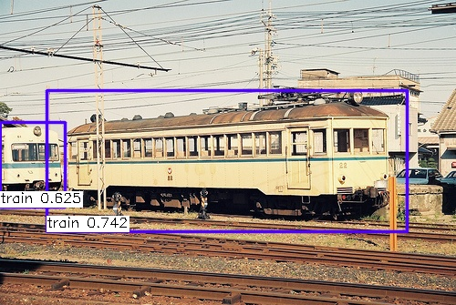
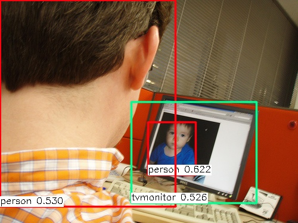
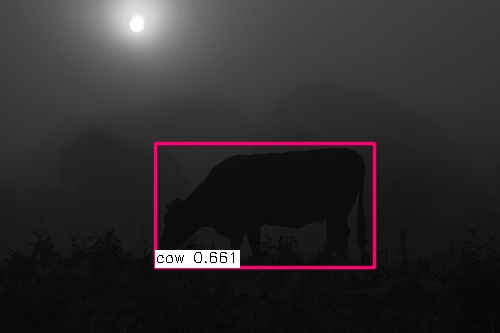

# keras-fcos
This is an implementation of [FCOS](https://arxiv.org/abs/1904.01355) on keras and Tensorflow. The project is based on [fizyr/keras-retinanet](https://github.com/fizyr/keras-retinanet)
and [tianzhi0549/FCOS](https://github.com/tianzhi0549/FCOS). 
Thanks for their hard work. 
## Test
1. I trained on Pascal VOC2012 trainval.txt + Pascal VOC2012 train.txt, and validated on Pascal VOC2007 val.txt. There are 14041 images for training and 2510 images for validation.
2. The best evaluation results on VOC2007 test are: 

| backbone | mAP |
| ---- | ---- |
| resnet50 | 0.6892 | 
| resnet101 | 0.7352 |

3. Pretrained model is here. [baidu netdisk](https://pan.baidu.com/s/1Gq3CGPltUumd3JwaCagbGg) extract code: yr8k     
4. `python3 inference.py` to test your image by specifying image path and model path there. 

 

## Train
### build dataset (Pascal VOC, other types please refer to [fizyr/keras-retinanet](https://github.com/fizyr/keras-retinanet))
* Download VOC2007 and VOC2012, copy all image files from VOC2007 to VOC2012.
* Append VOC2007 train.txt to VOC2012 trainval.txt.
* Overwrite VOC2012 val.txt by VOC2007 val.txt.
### train
* `python3 train.py --backbone resnet50 --gpu 0 pascal datasets/VOC2012` to start training.
## Evaluate
* `python3 utils/eval.py` to evaluate by specifying model path there.
